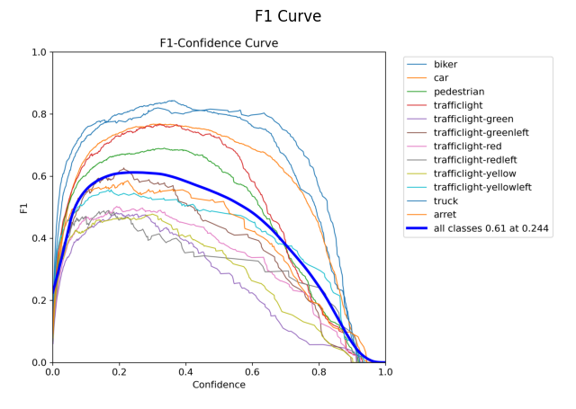
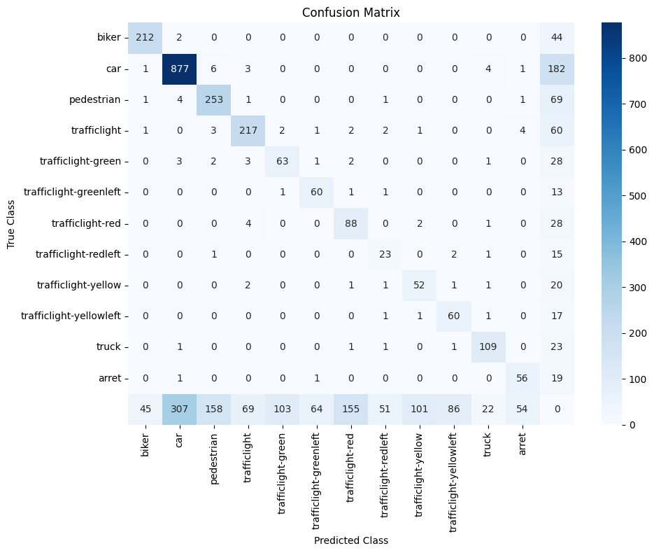

# YOLOv9 for Self-Driving Car Object Detection

## Overview
This project implements YOLOv9 for object detection in autonomous driving scenarios. 
The dataset was collaboratively created from driving videos and manually annotated 
in YOLO format.

## Dataset
Dataset was collaboratively created as part of a course project.
- Source: Driving videos captured in Canada
- Annotation: LabelImg (YOLO format)
- Pipeline:
  - Frame extraction from videos
  - Manual bounding box annotation
  - Dataset aggregation across multiple contributors  

Note: Dataset is not publicly available due to academic constraints.

## Methodology
- Data preprocessing and class filtering
- Dataset balancing using stratified sampling
- YOLOv9 training using Ultralytics framework
- Hyperparameter tuning for improved performance

## Results

### Overall Metrics

| Metric        | Value |
|--------------|------|
| Precision     | 0.736 |
| Recall        | 0.538 |
| mAP@0.5       | 0.595 |
| mAP@0.5:0.95  | 0.344 |
| F1 Score      | 0.622 |

## Sample Outputs



## Code
The full pipeline is implemented in:
`yolov9_detection.ipynb`

## Setup
```bash
pip install -r requirements.txt
